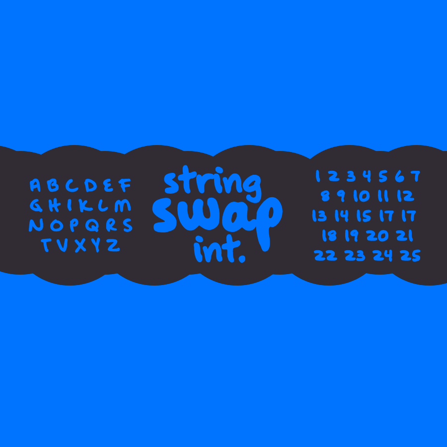

# NoNumbersKeyboardLibrary

[Remember - Cats and Asian girls are awesome](https://github.com/krvvko)




___
## File System:

- `~/NoNumbersKB.php` - Main Library Class
- `~/main.php` - Examples
- `~/src/img` - Images folder

## Basic Info:

Basically this library was created for users that in some reasons don't have access
to numbers on their keyboards. 
 - Do you have a broken number key? 
 - Your fingers are too short to reach out numbers on your keyboard? 
 - You've been typing too many numbers, so the keys erased and are not visible anymore? 
> **Then this Library is made for you!** 
___
## Examples:
Let's assume that there is a broken key ```5``` on your keyboard:

```php
// Create a nnkb (NoNumberKeyBoard) object
use KrvvkoHuh\NoNumbersKeyboardLibrary\NoNumbersKB;$nnkb = new NoNumbersKB();
```
Now we can complete all basic computer operations, you just need to 
assign the variable to the broken key!
```php
// Assigning variables to broken keys
$five = $nnkb->five();             // Example Number 5
$nine = $nnkb->nine();             // Example Number 9

// Tests (Everything is passing)
echo $five;                        // Output: 5
echo "\n";
echo $five + 5;                    // Output: 10
echo "\n";
echo $five + $nine;                // Output: 14
echo "\n";
var_dump($five == 5);              // True
var_dump($five == 9);              // False
```
___
**If this project will get 10 stars - then I will create library for users without letter keys!**
